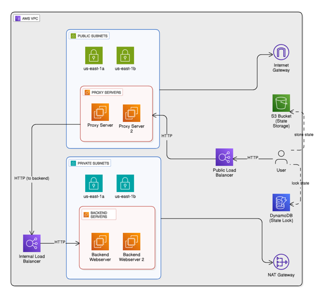

# 🔐 Secure Web App Infrastructure on AWS using Terraform

This project sets up a **secure 2-tier web application architecture** using **Terraform on AWS**. The setup includes:

- A **public proxy EC2 instance** (NGINX) in a public subnet
- A **private backend EC2 instance** (Flask App) in a private subnet
- **Modular Terraform design** for scalability and reuse
- Application: A blog-style Flask website (`cuteblog-flask`)

---

## 📌 Architecture


- **NGINX** reverse proxy routes incoming HTTP requests to the private backend.
- **Backend** runs a Flask app and is not exposed to the public internet.
- Traffic is controlled using custom **VPC, route tables, subnets, and security groups**.

---

## 📁 Project Structure

```bash
.
├── backend.tf              # Provisions the backend EC2 instance
├── backendscript.sh        # Bootstrap script for backend Flask server
├── main.tf                 # Root Terraform module caller
├── provider.tf             # AWS provider definition
├── proxyscript.sh          # Bootstrap script for NGINX proxy server
├── terraform.tfvars        # Input variables (user-defined values)
├── flask_website/
│   └── cuteblog-flask/     # Flask app: app.py, static, templates, etc.
├── modules/                # Modular Terraform definitions
│   ├── vpc_mod/            # VPC definition
│   ├── subnet_mod_pup/     # Public subnet
│   ├── subnet_mod_priv/    # Private subnet
│   ├── route_table_mod/    # Routing rules for subnets
│   ├── instance_proxy_mod/ # Proxy EC2 instance setup
│   └── instance_backend_mod/ # Backend EC2 instance setup
```

---

## 🚀 Deployment Steps

> ⚠️ Ensure you have:
> - AWS CLI credentials configured
> - Terraform ≥ 1.3 installed
> - SSH key pair defined or available

```bash
# Initialize Terraform
terraform init

# Check execution plan
terraform plan

# Deploy infrastructure
terraform apply
```

Once deployed:

- `all_ips.txt` will contain the public and private IPs.
- SSH into the public proxy:  
  ```bash
  ssh -i ~/.ssh/your-key.pem ec2-user@<proxy-public-ip>
  ```

---

## 🧪 Flask App (Backend)

- Located under: `flask_website/cuteblog-flask/`
- Entry point: `app.py`
- Templates: `templates/`  
- Styles: `static/cute.css`

---

## 🔐 Security Design

- Public EC2:
  - Open only to HTTP (port 80) and limited SSH (port 22) from your IP
- Private EC2:
  - Accessible only from the proxy via Security Groups
- Internet access for private instances via NAT Gateway (if needed)

---

## 🖼️ Backend App Preview


